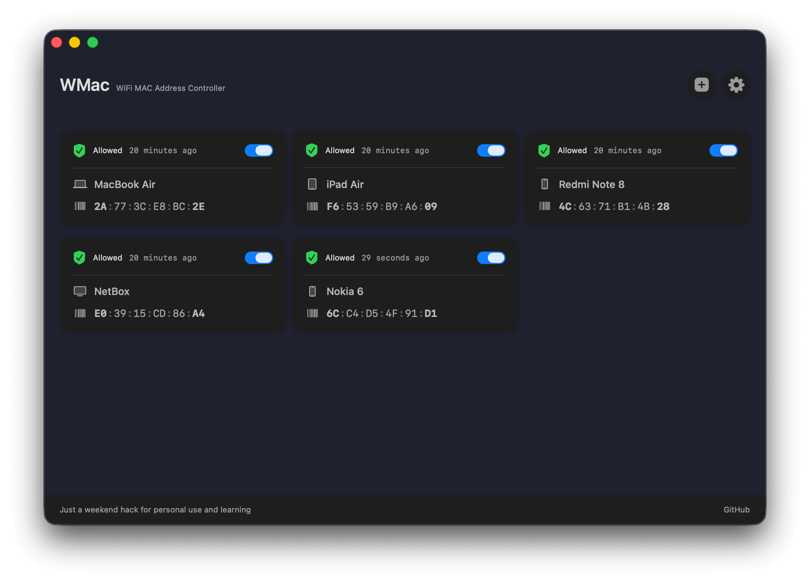

# WMac

> WiFi MAC Address Controller for Huawei EchoLife GPON Terminal

Just a weekend hack for personal use and learning.

A native macOS application built with SwiftUI that provides an intuitive interface to manage WiFi access control through MAC address filtering on Huawei EchoLife GPON Terminal routers.



## Requirements

- macOS 13.0 or later
- SSH access to your Huawei EchoLife GPON Terminal (see setup below)

## Quick Start

1. **Configure Connection Settings**
    - Click the Settings button (⚙️) in the top-right corner
    - Enter your router's IP address (e.g., `192.168.1.1`)
    - Enter SSH username (typically `root`)
    - Enter SSH password (found on device back)
    - Enter SSID Index (e.g., `SSID-1`)
    - Click "Test Connection" to verify

2. **Add Devices**
    - Press `⌘N` or click the `+` button
    - Enter device MAC address (format: `AA:BB:CC:DD:EE:FF`)
    - Choose device type and add an optional label
    - Click "Add Device"

3. **Control Access**
    - Toggle the switch on any device card to enable/disable WiFi access
    - Edit devices by double-clicking their cards
    - Delete devices through the edit dialog

## MAC Address Format

MAC addresses must be entered in the following format:

- Six pairs of hexadecimal digits (0-9, A-F)
- Separated by colons (`:`)
- Case insensitive
- Example: `AA:BB:CC:DD:EE:FF`

The app displays MAC addresses with visual emphasis on the first and last segments for better readability.

---

## SSH Access Setup

To use WMac, you need to enable SSH access on your Huawei router. This is typically disabled by default.

### 1. Access Web Interface

Navigate to `http://192.168.1.1` and login with:

```
Username: telecomadmin
Password: admintelecom
```

> 💡 Only `telecomadmin` has access to configuration file management.

### 2. Download Configuration

Navigate to: `Advanced → Maintenance Diagnostic → Configuration File Management`

Download the current configuration file.

> ⚠️ Keep a backup before making changes.
> 💡 If encrypted, decrypt first before editing (not required for all devices).

### 3. Configure SSH

Open the configuration XML file and add this line:

```xml
<X_HW_CLISSHControl Enable="1" port="22" Mode="0" AluSSHAbility="0"/>
```

> ⚠️ Add `X_HW_CLISSHControl` **before** `X_HW_CLITelnetAccess` in the XML file.

Find `SSHLanEnable` and change from `"0"` to `"1"`:

```xml
<AclServices ... SSHLanEnable="1" ... />
```

### 4. Upload Configuration

- Upload the modified configuration file
- Device will reboot automatically

### 5. Test SSH Connectivity

```bash
ssh -o HostKeyAlgorithms=+ssh-rsa -o PubkeyAcceptedKeyTypes=+ssh-rsa root@192.168.1.1
```

> 💡 Options required for older `ssh-rsa` algorithm.
> 🔑 Only `root` user can connect (password on device back). `telecomadmin` is web-only.

---

## Tested On

- Huawei HG8240 series

## License

This is a personal weekend project. Use at your own risk.

## Contributing

This is primarily a personal learning project, but feel free to fork and experiment!

## Disclaimer

⚠️ Modifying router configurations can affect your network connectivity. Always keep backups of your original configuration files. The author is not responsible for any issues arising from the use of this software.
